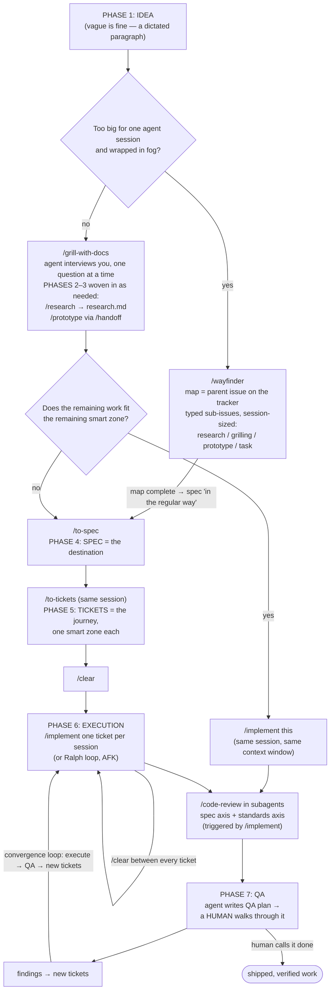

# 4. The End-to-End Workflow: From Idea to Shipped

This is the backbone chapter: the complete lifecycle that takes a vague idea — "the way that we handle ghost and real lessons is a little bit cumbersome in places" — through research, prototyping, spec, tickets, execution, and QA to shipped, verified work. Every later chapter deep-dives one phase; this chapter is the map, with every decision point marked: when to spec and when to just implement, when to reach for Wayfinder, when to clear your context, and when to loop back. The workflow described here is Matt Pocock's, distilled from his skills repo (162k GitHub stars, 7.5 million downloads at recording) and from watching him run it end-to-end on production code — and his core claim is that none of it is a paradigm shift: it is twenty years of engineering practice (architecture, feedback loops, delegation, not over-planning) applied to a new kind of colleague.

## The Seven Phases: A Methodology-Agnostic Map

Pocock's master framing is that any serious AI-assisted development effort moves through **seven phases**, whatever methodology you wrap around them — he names Ralph loops, GSD, and SpecKit as approaches that all map onto the same skeleton:

1. **Idea** — define what you want: an entire app, a narrow bug fix, a feature, or a refactor. The process scales both ways; scope can be as large or as small as you like.
2. **Research** *(conditional)* — if the idea involves external dependencies or expensive exploration (a Stripe integration, an uncommon API), research once and cache the findings as an asset the agent can read (e.g. `research.md`).
3. **Prototype** *(conditional)* — when you need to impose your taste on the outcome (UI look and behavior, but also architecture decisions or testing an external service), throw up multiple variants on a throwaway route, iterate human-in-the-loop, and commit the winner so the implementing agent can see it.
4. **Spec / PRD** — write the document that describes the destination: what the user will see and how it will behave. During its creation, prompt the agent to "absolutely grill" you, walking down every branch of your decision tree.
5. **Tickets** — a separate skill turns the spec into individual issues with blocking relationships (a kanban board = tickets + blocking relationships). Unblocked tickets are the parallelization frontier: one agent per unblocked ticket, though sequential is usually enough.
6. **Execution** — run a coding agent in a loop over the tickets. For Pocock this is usually a **Ralph loop** — a fresh-context agent loop over the backlog. With all the prior artifacts in place, "you can totally run this execution loop AFK and the results will be really good."
7. **QA** — the agent writes a QA plan; "then a human, yes, a human" walks through it, and also reads the produced code (unless a gray-box architecture makes that unnecessary — see [Chapter 3](03-preparing-your-codebase.md)). Findings become new tickets.

The phases are not a straight line. The last three — execution → QA → new tickets — form a **convergence loop** that runs many times, "until you iterate towards a perfect product."

> **Why it works:** Each earlier phase produces a concrete artifact — research cache, committed prototype, spec, tickets — and those artifacts are what let execution run unattended with good results. Front-loaded rigor is the price of AFK execution.

Pocock is explicit that this framework is a living draft ("I imagine these phases will grow to eight phases and nine phases") and acknowledges one gap in his own model: there is no explicit code-review phase. He speculates it belongs inside execution or under QA but calls it "definitely an essential step to producing good code" — and, as you'll see below, his newer skills bake it directly into the implementation step.

He is also explicit about who this is for: "This is not for vibe coders."

### Phase → skill → artifact

The phases are the theory; the **skills main flow** is the practice. Here is how the current skill set (v1.1 names) maps onto the phases and what each step leaves behind:

| Phase | Skill (current name) | Artifact produced |
|---|---|---|
| 1. Idea | seed for `/grill-with-docs`; `/wayfinder` if too big/foggy | a rough dictated prompt; a Wayfinder map issue |
| 2. Research | `/research` (background agent) | `research.md`, scoped to the sprint |
| 3. Prototype | `/prototype`, bridged in/out via `/handoff` | committed throwaway-route prototype |
| 4. Spec | `/grill-with-docs` → `/to-spec` | spec in the issue tracker; updated glossary + ADRs |
| 5. Tickets | `/to-tickets` | tickets sized to one smart zone each, with blocking relationships |
| 6. Execution | `/implement` (interactive) or a Ralph loop (AFK) | commits with tests + typechecks, closed tickets |
| 7. QA | QA-plan prompt + `/code-review` (invoked by implement) | QA plan issue; findings filed as new tickets |

## The Whole Flow at a Glance



Keep two mental anchors from this diagram:

> "The spec is the destination that we're heading to... and the tickets is the description of how we're going to get there."

and the sizing rule that governs everything downstream of the spec:

> "Each one of these tickets is supposed to just be the size of a single context window or a single smart zone."

## Phase Zero: Installing and Configuring the Skills

The main flow assumes the skills are installed and the repo is configured. This is a one-time cost per machine (install) plus once per repo (setup), and it is identical for brownfield and greenfield — for a brand-new project you run the same commands in an empty directory.

**Install:**

```bash
npx skills@latest add mattpocock/skills
```

This runs the skills.sh CLI installer (requires Node.js) and offers ~38 skills in two groups: the "Matt Pocock skills" (blessed, public-facing) and "other skills" (experimental, may be deleted later). Select all the official ones. Three decisions during install:

- **Which agents to configure** — the installer supports any harness (Cursor, Codex, Cline are universal defaults; select Claude Code and other Claude-skills consumers explicitly).
- **Scope: project vs global.** Pocock's guidance: **project-level if you work in a team** — everyone shares the same skill set per project and can contribute to the skills together. Global is fine for a solo developer.
- **Install method: choose symlink.** The alternative copies files into both the agents folder and the `.claude` folder — "not a nice way to do it. I wouldn't even make a decision here. Just choose symlink."

The context cost of installing everything is trivial by design: because the skills are user-invoked with short, precise descriptions, the entire set consumes only ~660 tokens of context (verifiable with `/context` in Claude Code) — unlike skill repos whose descriptions "leech their way" into every session.

**Setup, once per repo** — run `/setup-mattpocock-skills` inside your agent. It configures three things:

1. **Issue tracker.** The skills save specs and tickets somewhere, so pick a tracker: GitHub, local markdown, Jira, Linear, beads — "literally anything." There is no plugin to install; you just *tell the agent* during setup ("set it up with Jira") and it configures itself. This answers the most common support question about the repo. One caveat worth knowing before you pick: Pocock uses GitHub Issues himself for both the spec and the kanban board because it's easy, but notes plain GitHub Issues historically had no built-in way to represent blocking relationships between tickets — which is why he suggested Linear (which does support them) as the better fit if that matters to you. Since the kanban board *is* tickets-plus-blocking-relationships, this is not a cosmetic choice. That said, GitHub's sub-issue feature — the same mechanism Wayfinder now uses to build its maps as parent issues with typed, blocked sub-issues (see [below](#too-big-for-one-session-wayfinder)) — appears to have closed this gap since; if you're on GitHub today, check that your sub-issues support blocking relationships before assuming you need to switch trackers.
2. **Triage labels.** A label set the skills use to communicate information about produced tickets. Accept the defaults unless you care.
3. **Domain documentation.** The skills want a `context.md` file and ADRs in the repo. Choose single-context (right for 99% of people) vs multi-context (only for big monorepos needing multiple bounded contexts).

Setup then writes short links into `CLAUDE.md` pointing at docs under `docs/agents/` (issue tracker, triage labels, domain docs) — pointers, not inlined content. [Chapter 3](03-preparing-your-codebase.md) covers why that shape matters.

If you're lost at any point, there is an escape hatch: `/ask-matt` — "essentially me as a skill" — works as an interactive tutorial. Ask it "how do I get started? I want to make some code changes here. What is the main flow I should use?" and it will tell you exactly what this chapter tells you.

## How the Front of the Flow Evolved: Plan Mode → Grilling

The flow's opening move has a history, and knowing it prevents you from adopting a superseded practice.

Pocock's conversion to AI-assisted coding began with **plan mode** (Claude Code's write-disabled planning state): describe the task roughly, let the agent explore and write a plan, answer its unresolved questions, approve, execute, test, commit. He called that plan step "completely indispensable to getting decent outputs from an AI," and the underlying insight is permanent: an agent is like "a colleague who every time they made a commit forgot everything they'd ever learned about the repo," so you load context and hash out requirements *before* code — "something we've been doing for 50 years as developers."

His current position, however, is that a dedicated interviewing skill does this job better: the v1.1 main flow starts with "instead of using plan mode, you get an agent to grill you." **Grilling** — the agent interviewing *you*, one question at a time, until you both reach shared understanding — subsumes what plan mode did (explore first, surface unresolved questions) and adds structure plan mode lacks: it records learnings statefully into `context.md` and ADRs, distinguishes facts (which the agent must discover itself by exploring the code) from decisions (which only you can make), and refuses to act until you confirm — "do not enact the plan until I confirm we've reached a shared understanding." He also runs the flow in Claude Code's default auto mode, not plan mode. The recommendation of this guide follows the newer position: start with grilling, not plan mode. What survives from the plan-mode era: rough dictated prompts are fine, the agent's questions extract the missing requirements, and re-plan rather than wing it when surprises appear mid-execution.

## The Main Flow, Step by Step

This is "the main flow that all of my work runs through" — everything outside it is experimental. Run it "in one unbroken context window" when the work fits; externalize state into spec and tickets when it doesn't.

### 1. Seed a grilling session with a vague idea

Start a fresh session and run `/grill-with-docs`, seeded with your idea. It genuinely can be vague — his demo seed, dictated via voice transcription:

```text
I would like to remove most of the internal tooling on this CLI to make it
just only public facing. There's a lot of cruft here. I want to just take
this repo down a notch.
```

"It really can be as vague as this. You don't need to do too much here." The skill does the heavy lifting: it explores the codebase (building "a clear map of the entire repo" via explore subagents that keep the parent context small), then asks follow-up questions one at a time. Answer until you *and* the agent feel you've walked the whole tree — his demo took 6 questions; typical sessions run ~20. This is where you turn "I want to change X" into a crisp, defensible plan. One rule of craft that carries all the way from his live builds: state the WHY, not just the WHAT — "if it doesn't know the why, then it can't suggest alternatives."

If an open question needs a *runnable* answer rather than a conversational one — "how should it look" or "how should it behave" — bridge into the `/prototype` skill via `/handoff` and back. If every question can be settled by talking, skip prototyping. If a question needs external investigation, `/research` spins up a background agent that investigates against primary sources and writes findings to a markdown file — remember from the seven-phase model that research assets are ephemeral: they live only for the lifetime of the sprint, because stale research "can go out of date or rot away" and send the agent down a wrong turn. [Chapter 5](05-idea-to-spec.md) deep-dives all three thinking skills.

### 2. The fork in the road

Grilling ends with the agent laying out a plan. Now the single most important decision point in the whole workflow, and it is a context-window question:

- **The remaining work fits inside the remaining smart zone of the current session** → say `/implement this` in the same session and let it run. Done. One unbroken context window, no artifacts needed.
- **The work needs multiple sessions** → run `/to-spec` in the same session, then `/to-tickets`, then clear and implement ticket-by-ticket.

The judgment is a budget estimate, and he makes it out loud: "we've got 100k of budget here to remove 10 commands — super easy" → implement now. If you can't say that sentence honestly, take the spec path.

### 3. Compress the conversation: `/to-spec`, then `/to-tickets`

`/to-spec` compresses the entire grilling discussion — his demo's was 46.1k tokens — into a spec document published to your configured issue tracker: problem statement, solution, user stories, implementation decisions, testing decisions. The spec is the *destination*, "the description of everything of how it's going to look at the end."

Then, **in the same session — do not clear** — run `/to-tickets`. It turns the spec into an implementation plan of tickets, each sized to a single context window. The slicing is negotiable and you should negotiate it: when it proposed 3 slices for small work, he pushed back with "do it in one slice instead." Good tickets are short — "literally what do you build in this session" — with acceptance criteria living mostly in the main spec; his real-world reference example was a removal-spree spec with 11 sub-issue tickets, each one a single-context-window session. [Chapter 6](06-tickets-and-planning.md) covers slicing, blocking relationships, and triage in depth.

A note on names: `/to-spec` and `/to-tickets` were renamed in v1.1 from `/to-prd` and `/to-issues`, and the rename is doctrine, not cosmetics. What the flow produces is not strictly a PRD — a PRD describes the product itself, and non-PRD material (technical decisions) was leaking in; "specification is a much broader term... can be technical, non-technical, or blend the two." And "issues" was biased toward GitHub/Linear terminology, where tickets is tracker-neutral: "you have a spec and then underneath the spec you have the tickets that are the journey that you take to actually enact the spec." He called the migration friction "good friction because it names it properly." (If you installed before the rename: the installer does not auto-migrate renames — delete the old skills, re-add, and audit your skills folder for stale ones.)

### 4. Clear, then implement one ticket per session

Now `/clear`. Then reference the tickets (`@tickets`) and say `/implement this`. Because the spec decides where you're going and the tickets decide how you get there, the fresh agent has everything it needs — that is the entire point of the artifacts.

Implement tickets **one by one**. After a ticket completes, check your context usage; occasionally you can squeeze in one more, but "usually clear between every single ticket."

> **Rule:** Never say "do every single ticket" — each ticket is sized to one smart zone, and stacking them degrades quality. Implement one, check context usage, then usually `/clear` before the next.

The `/implement` skill itself is deliberately minimal — its near-verbatim entire content:

```markdown
Implement the work described by the user in the spec or tickets.
Use TDD where possible at pre-agreed seams. Run type checking regularly.
Single test files regularly. Full test sweep once at the end.
Once done, use code review to review the work and then commit your work
to the current branch.
```

Pocock almost didn't ship it because the agent's harness training already covers most of this — but it "earns its place" as the named step so people know the flow. In practice it implements the ticket, runs typecheck and build, does extra behavioral verification (in his demo: confirming the CLI's `--help` output showed only the intended command), then triggers review and commits. [Chapter 7](07-execution.md) covers execution sessions in detail.

### 5. Built-in review: fresh eyes, two axes

`/implement` finishes by invoking the `/code-review` skill — in **subagents**, never in the main agent, because "agents are often really bad at editing code or improving code they've just written because they wrote it. So they just think, 'Okay, that's fantastic. That's fine.'" Two parallel subagents run, one per axis:

- **Spec axis** — does the code faithfully implement the originating spec, cross-checking *every acceptance criterion*? Over a big multi-session chunk "the agent might have forgotten things in tickets or the tickets might have been under-specified. Doing a final pass means you actually nail everything."
- **Standards axis** — does the code conform to this repo's documented coding standards (a `coding-standards.md` file, kept *outside* your agents file)? If none exist, it falls back to a ~10-line checklist of Martin Fowler's code smells from *Refactoring*.

This closes the seven-phase model's acknowledged code-review gap: review lives inside execution, at the end of every implement run, plus as a final pass against the spec when all tickets are done. The full review-and-QA machinery — including the Fowler smells and de-slopping — is [Chapter 8](08-review-and-qa.md).

## Too Big for One Session: Wayfinder

Some ideas are too large even to *plan* in one session. Grilling a huge idea inside `/grill-with-docs` means managing handoffs and worrying about blowing the smart zone mid-conversation. The v1.1 answer is `/wayfinder`, and its skill description states the trigger condition precisely:

> "A loose idea has arrived, too big for one agent session and wrapped in fog. The way from here to the destination isn't visible yet. This skill charts the way as a shared map on the repo's issue tracker, then works its tickets one at a time until the route is clear."

Mechanically: Wayfinder creates a parent issue — the **map** — on your issue tracker. Every decision that needs making becomes a **sub-issue** with **blocking relationships** (a key decision at the start can block everything else). Each sub-issue is scoped to the size of one agent session and labeled with one of four **ticket types** (defined at the bottom of the map ticket):

- **Research** — an AFK task: the agent goes off via `/research`, investigates, comes back.
- **Grilling** — a decision that needs an interview session with you.
- **Prototype** — "raise the fidelity of the discussion by making a cheap rough concrete artifact to react to" via `/prototype` (which is model-invoked, so Wayfinder can call it itself). Use whenever "how should it look" or "how should it behave" is a key question — which is why Pocock recommends Wayfinder for almost anything touching front-end code.
- **Task** — config, provisioning, moving data into shape: "the boring stuff that doesn't need a grilling decision and can't really be automated by AI."

You work the tickets one at a time, each in its own session, until the route is clear. When all tickets close, the captured information is saved onto the map, with the closed tickets remaining as "primary sources for what was captured." Then the completed map goes to `/to-spec` "in the regular way" and rejoins the main flow.

Two properties make this the newest recommended entry point for big work. First, it delegates context management: "instead of having the anxiety of managing my session with Grill with Docs, having to hand off, worry about the smart zone, with Wayfinder it's kind of all managed for me." Second, because the map lives on the issue tracker rather than in a chat session, it is collaborative and shareable across a team. Pocock wants users to "default to Wayfinder instead" of grill-with-docs for this class of work, and uses it himself "for literally everything, even non-coding stuff" — including planning a course. His shown example: a spike on the Sandcastle repo evaluating the AI SDK as a dependency — "a big big change" — with a blocking key decision at the start.

## Which Path Do I Take?

The decision comes down to two dimensions: how big the work is relative to an agent session, and how foggy the route is.

| Situation | Signals | Path |
|---|---|---|
| Trivial change in a repo you know inside-out | You know the exact diff already | Just do it yourself — but Pocock notes these cases are limited (in a large org you deeply know only a few repos) |
| Small, answerable by conversation | After grilling, remaining work fits the remaining smart zone ("100k of budget to remove 10 commands — super easy") | `/grill-with-docs` → `/implement this`, one unbroken context window |
| Multi-session, but the route is visible | Grilling reaches shared understanding, work exceeds one session | grill → `/to-spec` → `/to-tickets` → `/clear` → `/implement` per ticket |
| Big and foggy — the route is not visible; or it touches front-end | "Too big for one agent session and wrapped in fog"; look/behavior questions unanswered | `/wayfinder` → work typed sub-issues one session each → `/to-spec` → `/to-tickets` → implement |
| Backlog of well-specified tickets you want done while AFK | Spec + tickets exist; repo runs tests and typechecks on every commit | Ralph loop / Sandcastle ([Chapter 9](09-afk-and-parallel-agents.md)) |

Two refinements. First, the question of *how many ideas per flow*: decide up front whether multiple ideas share one grilling session and spec or get split — "will this crowd out the grill-me session or will it all fairly seamlessly link together?" Second, prototyping vs iterating: some decisions can't be settled by talking *or* prototyping cheaply, and Pocock sometimes consciously chooses "build it one way and offer feedback afterwards" — during the ghost-courses build he skipped a 3–5-variant UI prototype phase because "I couldn't get a sense for which way to go until I saw it in reality... I don't mind jumping to code and fixing it there."

## Budgeting the Context Window Across the Flow

The workflow's shape is not arbitrary — every artifact and every `/clear` exists because of one number. Pocock treats the context window as "ending or getting significantly dumber at around the 140k mark" — the **smart zone**; beyond it comes attention degradation, "weird hallucinations" ([Chapter 1](01-how-llms-actually-work.md) explains why). "Being conscious about the context window that you're using, the tokens that you're using, is essential to using AI well."

The budget rules across the flow:

- **One unbroken context window when possible.** The ideal run is grill → implement in a single session — shared understanding never has to survive a compression step.
- **The fork decision is a budget estimate.** After grilling, ask what's left in the smart zone versus what the work needs. Grilling itself is cheap on the parent context thanks to explore subagents that read "tons and tons of files" in their own windows and hand back summaries — a ~22-minute grilling session left the ghost-courses build at only ~40k tokens; the skills-demo grilling ran 46.1k before compression.
- **Spec + tickets are context-compression artifacts.** They exist so a *fresh* session can carry on: the 46.1k-token discussion compressed into a spec; the whole subsequent implement run cost only 42.7k tokens.
- **One ticket = one smart zone.** That's the sizing definition, and it's also why you `/clear` between tickets rather than stacking them.
- **Prefer conversation over tool calls in the thinking phases.** The grilling skill deliberately avoids the built-in ask-user-question tool partly because "not calling a tool is always more token-efficient" — every tool call is wrapped in JSON.
- **When even planning would blow the zone, escalate to Wayfinder**, which splits planning itself into session-sized tickets.

> **Warning:** Going past ~140k does not fail loudly. The agent keeps producing output — it just gets stupider. The workflow's clears and artifacts are your defense; if you skip them, nothing warns you that quality is degrading.

## Worked Example: The Ghost-Courses Feature

Everything above, run for real: a ~42-minute recorded build in Pocock's production "course video manager" (~1,200 commits, ~637 closed issues — the app he records his videos in). This session predates the v1.1 renames, so the skill names are the older generation: `/grill-me`, write-PRD, PRD-to-issues (today: grill-with-docs / `/to-spec` / `/to-tickets`). The flow is the same.

**The idea (day shift begins).** Two vague feature ideas — "this is maybe how you enter most days as a developer... small tweaks based on vague ideas." The domain: his app tracks **ghost lessons** — lessons that exist in the database but not yet on the file system — and he wanted (1) direct create/delete of real lessons without the ghost step, and (2) **ghost courses**. He dictated the rough requirement including the why: "The reason I want this is so that I can plan courses freely without needing to commit to an exact shape on the file system." He even invited the agent into the uncertainty: "I'm not sure about that flow. Maybe we can work on that together."

**Grilling (~22 minutes).** `/grill-me` ran an explore phase, then interrogated him Socratically. It challenged his framing against the actual code ("delete lesson already handles both ghost and real lessons directly... Is there something in the UI that forces the convert-to-ghost-then-delete flow?"). It forced woolly language precise ("when you say a ghost course could have real lessons, what does *real* mean without a file system?"). It asked combinatorial scope questions ("does direct create apply inside ghost courses too?" — his reaction: "that's so freaking smart") and probed edge cases ("you delete all the real lessons — does the real course become a ghost course?"). Constraints got captured as invariants: "Once a course has a file path, it stays real forever." When the agent wrongly claimed no test harness existed for a service, he didn't argue — he said "look harder," and it found the whole suite. Twenty-two minutes later: eight bullet points of pinned-down scope, ~40k tokens of context, and a transcript that is "incredibly good fodder" for the spec — Q&A collocates question with answer, which "shows up as a hot spot for the LLM in terms of its attention mechanism."

**Ubiquitous language.** Before speccing, he had the agent update the repo's **ubiquitous language** document — a Domain-Driven Design glossary defining every domain term — with the vocabulary agreed during grilling: **materialize** ("the act of transitioning a ghost entity to a real entity by creating its on-disk representation"), the **materialization cascade** (the chain reaction when materializing a lesson inside a ghost course), plus "aliases to avoid." He committed it himself. The payoff compounds: later he can say "there's a bug inside the materialization cascade" and the agent knows exactly what he means, and new function names fall out for free (`materializeGhost`, `addGhostLesson`).

**PRD.** "I'm satisfied" → invoke the write-PRD skill. It sketched the major modules being changed and surfaced them for review, and asked which modules should get tests. He scrutinized the *interfaces*, not implementations — debating whether a new `materializeCourseAndLesson` method beats adding a parameter to `materializeGhost` (the extra param would be "dodgy API-wise"; new method wins): "I want to make sure this is testable and that the rest of the repo and any future AI agents can understand what it's doing." He also cut scope creep — the skill proposed deprecating an old feature as module 6; he removed it ("not as part of this PRD"). The PRD — user stories, implementation decisions, and testing decisions (the last making the execution loop "more likely to follow TDD and create feedback loops as it's going") — went out as a GitHub issue. He did **not** review the PRD prose: "LLMs are really, really good at summarizing things," and the conversation itself was the review.

**Issues.** With the PRD still in context: "PRD to issues." It produced GitHub issues with blocking relationships, acceptance criteria, and links to the parent PRD. He reviewed only the *slicing granularity* — "hide the publish/export UI" was too tiny to justify "the cost of kicking up an entire agent," so he merged it into another issue, ending with 4 slices from 6. "If the parent PRD is the destination, then these issues are the journey to get there."

**Execution (night shift).** `pnpm ralph` — his Ralph loop, later open-sourced as **Sandcastle**: an AFK agent in a Docker container, max 100 iterations, that pulls the GitHub issues, picks one, implements it, runs tests and typechecks on every commit ("making sure it runs tests and types on every single commit" is the key success factor), commits with a detailed message, closes the issue, and repeats until the issues run out. He walked away — walk, tea, or a *new* grilling session in another terminal. The run: 5 iterations, ~1.5 hours, 6 commits. This is the **day shift / night shift** division (the phrase coined by his friend Jamon): the human does the thinking work — ideation, grilling, specs, slicing — and agents execute in the background. The workflow only *seems* slow "because you're trying to extract ideas out of your human brain. And while this is happening, you've got AFK agents running in the background implementing your previous grilling sessions." (Sandboxing, permissions, and the full Sandcastle setup are [Chapter 9](09-afk-and-parallel-agents.md).)

**QA.** When the loop finished, a fresh session and a prompt he has since considered baking into a skill:

```text
Take the last five commits and create a QA plan for me. Save that QA plan
in a GitHub issue. The QA plan should give me a step-by-step guide on how
to test every single part of the new implementation.
```

He labeled the QA-plan issue human-only so the Ralph loop wouldn't pick it up (the loop's prompt includes: if an issue has a human-in-the-loop label "or it looks like it's for humans, don't work on it"). Then he rebuilt the app and walked through the plan manually.

**The feedback loop.** QA found what no amount of planning would have: a showstopper where a non-git-repo directory left the database and filesystem out of sync — an edge case never raised in grilling. It also caught internal jargon leaking into the UI ("ghost course" shown to end users) — reversed. Every problem went in via an in-app **feedback button**: he dictates the issue, and it files a GitHub issue with a Haiku-generated title, the route it came from, and his verbatim feedback plus any pasted errors — "this information is enough for Ralph to do a really nice job." He filed 6–7 issues in 8 minutes *while re-running `pnpm ralph` in parallel* — bugs got fixed in the background while he found more. When behavior drifted, he closed the stale QA-plan issue so the agent wouldn't treat it as source of truth. Final tally: 8 iterations, 14 commits, feature shipped.

The lesson he draws from that showstopper is the workflow's closing argument:

> "The specs-to-code approach is just never going to work because when you're in the QA loop... you are going to find little weird edge cases that are really hard to plan for before."

Spec-first is necessary; spec-*only* is a fantasy. The seven phases end in a loop, not a gate, and the human QA pass is the checkpoint that makes everything upstream — including AFK execution — safe. Once the thinking is front-loaded, though, "from here it's pretty much all on Rails... we have done the human-in-the-loop bit."

## Checklist

- [ ] Install the skills: `npx skills@latest add mattpocock/skills` — project scope for teams, symlink method.
- [ ] Run `/setup-mattpocock-skills` once per repo: pick your issue tracker (just tell it which), accept triage labels, single-context domain docs unless you're a big monorepo.
- [ ] Start every piece of work with grilling, not plan mode and not code: seed `/grill-with-docs` with a rough dictated idea *including the why*.
- [ ] During grilling: bridge to `/prototype` (via `/handoff`) when a question needs a runnable answer; `/research` for external unknowns; delete research assets when the sprint ends.
- [ ] At the fork, estimate the budget: work fits the remaining smart zone → `/implement this` in the same session; otherwise `/to-spec` → `/to-tickets` (same session), then `/clear`.
- [ ] Too big or foggy to even plan in one session — or touches front-end? Default to `/wayfinder`; work its typed sub-issues one session each, then `/to-spec` from the completed map.
- [ ] Negotiate ticket slicing: merge tickets too small to justify agent startup cost; each ticket = one smart zone, acceptance criteria live in the spec.
- [ ] Implement one ticket per session; `/clear` between tickets; never say "do every single ticket."
- [ ] Let `/implement` finish its job: typecheck, build, behavioral verification, `/code-review` in subagents (spec axis + standards axis), commit.
- [ ] Maintain the ubiquitous-language doc: update it after every grilling session, commit it.
- [ ] After execution, generate a QA plan into a human-labeled issue; a human walks through it; file findings as new tickets; close the QA plan when behavior drifts.
- [ ] Loop execution → QA → new tickets until *you* call it done — plan for the loop, not for a perfect spec.
- [ ] If you installed pre-v1.1: delete `/to-prd` and `/to-issues`, re-add the renamed skills, and audit your skills folder for stale entries.

## Sources

- The 7 phases of AI-driven development
- mattpocock/skills: A complete AI Coding workflow, end-to-end
- Building a REAL feature with Claude Code: every step explained
- New Skills! v1.1 brings /wayfinder, /research, /implement, /to-spec, /to-tickets
- I Open-Sourced My Own AFK Software Factory
- I was an AI skeptic. Then I tried plan mode

See also: [Chapter 1 — How LLMs Actually Work](01-how-llms-actually-work.md) for the smart-zone mechanics behind every budgeting rule here; [Chapter 3 — Preparing Your Codebase](03-preparing-your-codebase.md) for the docs and feedback loops the flow assumes; [Chapter 5 — From Idea to Spec](05-idea-to-spec.md) for grilling, research, and prototyping in depth; [Chapter 6 — Tickets and Planning](06-tickets-and-planning.md) for slicing and blocking relationships; [Chapter 7 — Execution](07-execution.md) for implementation sessions; [Chapter 8 — Review, QA, and De-Slopping](08-review-and-qa.md) for the two-axis review and QA plans; [Chapter 9 — AFK and Parallel Agents](09-afk-and-parallel-agents.md) for Ralph loops and Sandcastle; [Chapter 12 — Skill Catalog](12-skill-catalog.md) for every skill named in this chapter.
