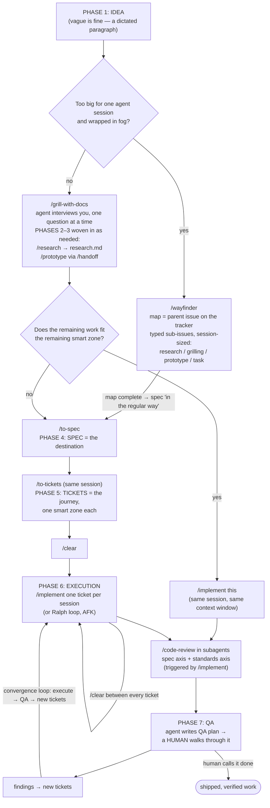

# The AI-Driven Development Guide

A comprehensive guide to building software with AI coding agents — distilled from 33 sources: Matt Pocock's skills-repo tutorials and workflow videos, an Andrej Karpathy interview on the post-2025 agentic-coding shift, a GitHub senior engineer's take on system design and AI delegation, and a context-engineering explainer. Thirteen chapters, one glossary, one skill catalog, cross-linked into a single coherent system.

## Why this guide exists

The obvious failure mode of AI-assisted development is that quality depends on who happens to be prompting that day. One developer grills the agent thoroughly, sizes their tickets correctly, and reviews with fresh subagents; another pastes a vague request into a stale codebase and ships whatever comes back. Same tools, wildly different outcomes — a **skill issue**.

This guide's thesis, developed across every chapter and made explicit in [Chapter 11](11-team-blueprint.md), is that this is fixable — not by finding better prompters, but by moving quality out of individual judgment and into **process**: a prepared codebase, a staged workflow with real decision points, and versioned skills that encode the instincts a good developer already has. Read end to end, this guide is the blueprint for a workflow where the process owns the skill, and there is no such thing as a skill issue anymore.

## How to use this guide

- **New to AI-assisted development?** Read in order, 1 → 13. Chapter 1 gives you the mental model everything else depends on; each later chapter builds on it.
- **Already running agents day to day?** Start at [Chapter 4](04-the-workflow.md) (the workflow backbone), then branch into whichever phase chapter matches what you're struggling with.
- **Rolling this out to a team?** Read [Chapter 11](11-team-blueprint.md) first for the destination, then backfill the chapters it points you to.
- **Building your own skills?** [Chapter 10](10-building-skills.md) teaches the craft; [Chapter 12](12-skill-catalog.md) is the reference catalog of every skill and harness feature named in the source material, with construction notes for building your own version of each.
- **Forgot what a term means?** [Chapter 13](13-glossary.md) is the guide's own ubiquitous language — one precise definition per term, linked back to where it's developed.
- **Just want the workflow running, without reading any of this?** [`init.sh`](../init.sh) (one level up, in this kit) installs the skills and wires up `CLAUDE.md` in any repo for you — this guide becomes background reading you never have to open.

Every chapter ends with a **Checklist** (the chapter compressed into actions) and a **Sources** list (which videos it draws on). Grounding is strict throughout: every technique, number, and quote traces back to the source material — nothing here is invented, and where a chapter had to trim a claim the sources didn't support, it says so rather than filling the gap with plausible-sounding filler.

## The system in one picture

The whole workflow, phase by phase, skill by skill, artifact by artifact — developed in full in [Chapter 4](04-the-workflow.md):

Two lines carry the whole diagram:

> "The spec is the destination that we're heading to... and the tickets is the description of how we're going to get there."

> "Each one of these tickets is supposed to just be the size of a single context window or a single smart zone."

## Table of contents

| # | Chapter | What it covers |
| --- | --- | --- |
| 1 | [How LLMs Actually Work](01-how-llms-actually-work.md) | Tokens, context windows, the smart zone, agents, subagents, and context engineering — the mechanics behind every rule in the rest of the guide |
| 2 | [Operating Principles](02-principles.md) | Never trust an LLM, delegate like a lead, own the *why* and hand over the *how*, business impact over craft aesthetics |
| 3 | [Preparing Your Codebase](03-preparing-your-codebase.md) | Feedback loops, gray-box modules, domain docs, a minimal CLAUDE.md backed by hooks, frontend readiness |
| 4 | [The End-to-End Workflow](04-the-workflow.md) | The backbone chapter: the seven phases and the main skills flow, worked end to end on a real feature |
| 5 | [From Idea to Spec](05-idea-to-spec.md) | Grilling, plan mode, research caching, prototyping, and writing the spec |
| 6 | [Tickets and Planning](06-tickets-and-planning.md) | Slicing a spec into session-sized tickets, blocking relationships, triage, Wayfinder maps |
| 7 | [Execution](07-execution.md) | The `/implement` skill, TDD with agents, context hygiene, handoff, worktrees |
| 8 | [Review, QA, and De-Slopping](08-review-and-qa.md) | Two-axis subagent review, Fowler code smells, QA plans, the feedback loop, de-slopping |
| 9 | [AFK and Parallel Agents](09-afk-and-parallel-agents.md) | The Ralph Wiggum technique, sandboxed AFK factories, agent fleets, the guardrails that keep them safe |
| 10 | [Building Skills](10-building-skills.md) | Skill anatomy, stateless vs. stateful design, wording that makes instructions stick, installing and versioning |
| 11 | [The Team Blueprint](11-team-blueprint.md) | The capstone: assembling everything into a team workflow where quality is enforced by process, not talent |
| 12 | [Skill Catalog](12-skill-catalog.md) | Reference: every named skill and harness feature, grouped by phase, in one consistent format |
| 13 | [Glossary](13-glossary.md) | The guide's own ubiquitous language — every term of art, defined once, linked to its chapter |

## A note on grounding and evolution

The source material spans real time — a skills repo that shipped v1.1 mid-recording, a technique the author abandoned for a better one, an interview capturing a specific week in late 2025. Where sources evolved (`/grill-me` → `/grill-with-docs` → Wayfinder; `/to-prd` → `/to-spec`; the old `/init` advice → the new one), this guide presents the evolution explicitly and recommends the newest position — see the supersession map in [Chapter 12](12-skill-catalog.md). Where two sources disagree or a claim is one person's opinion rather than settled fact, the guide attributes it rather than flattening it into house style.
